  

## Hi, I'm Yesirat.

I am building a personal corner of the internet that feels deliberate: minimal where it should be, expressive where it matters, and sharp enough to reflect how I actually think.

My interests sit at the intersection of intentional web experiences, applied cryptography, and decentralized systems. I care about clarity, and I am currently exploring (quite a lot) to refine my interest as best as possible

This profile is part of the same work as my website: still evolving, getting cleaner with every pass, and becoming more honest about what I want to build.

## What I'm Focused On

- Building a deliberate space with my career in CS (I am currently a student)
- going deeper on applied cryptography and security-minded engineering
- building with more rigor, more taste, and more attention to detail
- solving hard problems because they are worth understanding

## What You Can Expect From Me

- thoughtful interfaces over noisy ones
- clean structure, fast feedback, and visible iteration
- curiosity backed by actual shipping
- a bias toward decentralization, ownership, and learning in public

## Contribution Snake

<picture>
  <source
    media="(prefers-color-scheme: dark)"
    srcset="https://raw.githubusercontent.com/Yesy01/Yesy01/output/github-snake-dark.svg"
  />
  
</picture>

## Stack and Interests

  
  
  
  
  
  

## Stats

  
  

## Contact

- GitHub: [@Yesy01](https://github.com/Yesy01)
- Email: [yesiratsanni49@gmail.com](mailto:yesiratsanni49@gmail.com)
- Portfolio: [yesy01.github.io/YesiratSanni](https://yesy01.github.io/YesiratSanni)

---

  Built with intent. Still becoming.

